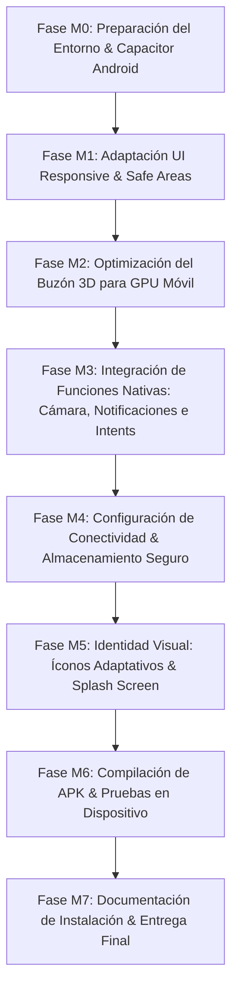

# 📱 Plan de Trabajo, Requerimientos y Tecnologías — Versión Móvil Android (APK)
## *Planesito de Vida 💌✨ — Nuestras Aventuras (Velada)*

> **Documento de Especificación y Planificación Técnica para Aprobación**  
> **Fecha:** Septiembre 2026  
> **Versión:** 1.0.0-mobile  
> **Plataforma Objetivo:** Android (Instalable mediante archivo APK / Sideloading $0)  
> **Presupuesto:** **$0.00 USD (Tecnologías 100% Gratuitas y de Código Abierto)**

---

## 📑 Tabla de Contenidos
1. [Resumen Ejecutivo y Objetivos](#1-resumen-ejecutivo-y-objetivos)
2. [Análisis de Alternativas y Tecnologías Elegidas (100% Gratuitas)](#2-análisis-de-alternativas-y-tecnologías-elegidas-100-gratuitas)
3. [Requerimientos de la Versión Móvil](#3-requerimientos-de-la-versión-móvil)
   - 3.1 Requerimientos Funcionales Heredados de la Web (Paridad 100%)
   - 3.2 Requerimientos Funcionales Específicos para Android (Nativos)
   - 3.3 Requerimientos No Funcionales Móviles (Rendimiento, Batería, UX Táctil)
   - 3.4 Restricciones Técnicas y de Costo
4. [Arquitectura del Sistema Móvil Android](#4-arquitectura-del-sistema-móvil-android)
5. [Plan de Trabajo por Fases (Roadmap de Desarrollo)](#5-plan-de-trabajo-por-fases-roadmap-de-desarrollo)
6. [Estrategia de Compilación, Empaquetado e Instalación del APK](#6-estrategia-de-compilación-empaquetado-e-instalación-del-apk)
7. [Matriz de Riesgos y Mitigación](#7-matriz-de-riesgos-y-mitigación)
8. [Criterios de Aceptación y Checklist Pre-Desarrollo](#8-criterios-de-aceptación-y-checklist-pre-desarrollo)

---

## 1. Resumen Ejecutivo y Objetivos

La aplicación web actual **Planesito de Vida / Velada** es una plataforma romántica interactiva para parejas con dos perfiles diferenciados (**Novio** y **Novia**), que combina correspondencia postal, buzón 3D con Three.js, cartas con esquinas dobladas interactivas (*dog-ear*), mapas Leaflet/OpenStreetMap, exportación a Google Calendar (.ics), galerías polaroid y sincronización privada por Código QR.

El objetivo de esta fase es **trasladar el 100% de la funcionalidad actual a una aplicación nativa para Android empaquetada en formato APK instalable**, proporcionando:
- **Instalación directa en cualquier dispositivo Android** sin necesidad de pagar licencias ni membresías (ej. cuenta de desarrollador de Google Play Console de $25 USD).
- **Experiencia nativa completa**: icono en el cajón de aplicaciones, pantalla de bienvenida (*Splash Screen*) artesanal, funcionamiento a pantalla completa sin barras del navegador, soporte de gestos táctiles y vibración háptica.
- **Integración con hardware del teléfono**: cámara para escaneo de códigos QR de emparejamiento, notificaciones locales del sistema en la barra de tareas de Android para recordatorios de citas, e intents nativos para abrir calendarios y mapas del sistema.
- **Rendimiento fluido** de la escena 3D y las animaciones de sobres y cartas sobre procesadores móviles.

---

## 2. Análisis de Alternativas y Tecnologías Elegidas (100% Gratuitas)

Para cumplir con la estricta restricción de **costo $0.00 USD** y **preservar todas las funcionalidades** (especialmente la escena 3D en WebGL de Three.js, las físicas de Framer Motion, los mapas de Leaflet y los estilos Tailwind), se evaluaron tres caminos técnicos:

### 2.1 Comparativa de Opciones Arquitectónicas

| Criterio | Opción A: Reescritura en React Native / Flutter | Opción B: PWA pura en navegador | Opción C: Capacitor Android (Elegida) |
|---|---|---|---|
| **Costo de licencias** | Gratis ($0) | Gratis ($0) | **Gratis ($0, Licencia MIT / Apache 2.0)** |
| **Tiempo y riesgo** | Muy alto (Reescribir miles de líneas, shaders 3D y Leaflet) | Muy bajo (Solo manifest.json) | **Rápido y controlado (Aprovecha el 100% del código probado)** |
| **Paridad 3D (Three.js)** | Alto riesgo de incompatibilidad con Three.js y shaders WebGL | Idéntica a web | **100% Idéntica (Aceleración por hardware WebGL nativo en Android WebView)** |
| **Instalación como APK** | Sí (Genera APK) | No (Solo acceso directo en Chrome) | **Sí (Genera archivo `.apk` autónomo e instalable)** |
| **Acceso a Hardware** | Nativo completo | Limitado por navegador | **Nativo vía Plugins de Capacitor (Cámara, Notificaciones, Haptics)** |
| **Costos de distribución** | $0 sideloading | $0 web | **$0 sideloading directo del archivo APK** |

### 2.2 Stack Tecnológico Oficial Seleccionado ($0 Costo)

Todas las tecnologías seleccionadas son de código abierto o cuentan con capas gratuitas permanentes sin necesidad de registrar tarjetas de crédito:

```
┌─────────────────────────────────────────────────────────────────────────────┐
│                           STACK TECNOLÓGICO MÓVIL                           │
├──────────────────────────────┬──────────────────────────────────────────────┤
│ Componente                   │ Tecnología Seleccionada & Licencia           │
├──────────────────────────────┼──────────────────────────────────────────────┤
│ 1. Contenedor Nativo Android │ Capacitor 6 / 7 (Ionic) — Licencia MIT ($0)  │
│ 2. Entorno de Compilación    │ Android SDK + OpenJDK 17 + Gradle ($0)       │
│ 3. Frontend UI               │ Next.js 14 / React 18 + TypeScript ($0)      │
│ 4. Estilos y Diseño          │ Tailwind CSS + Lucide Icons (MIT, $0)        │
│ 5. Motor 3D y Efectos        │ Three.js + Framer Motion (MIT, $0)           │
│ 6. Mapas y Ubicación         │ Leaflet + OpenStreetMap + Nominatim ($0)     │
│ 7. Acceso a Cámara y QR      │ Capacitor Camera / html5-qrcode con permisos │
│                              │ nativos en AndroidManifest.xml (MIT, $0)    │
│ 8. Notificaciones de Citas   │ @capacitor/local-notifications (MIT, $0)     │
│ 9. Exportación Calendario    │ Intents nativos de Android + .ics (RFC 5545) │
│ 10. Persistencia Local Segura│ @capacitor/preferences / LocalStorage (MIT)  │
│ 11. Backend & Base de Datos  │ Next.js API Routes (Vercel $0) +             │
│                              │ MongoDB Atlas M0 Clúster Gratuito ($0)       │
└──────────────────────────────┴──────────────────────────────────────────────┘
```

#### Justificación de cada tecnología:
1. **Capacitor Android**: Creado por Ionic, es el estándar de la industria para convertir aplicaciones web modernas en binarios Android nativos con proyectos Gradle estándar (`android/`). No añade sobrecarga propietaria y permite compilar APKs estándar.
2. **Android Studio & Gradle**: Herramientas oficiales y gratuitas provistas por Google. Permiten compilar el `.apk` en modo `debug` o `release` firmado sin coste alguno.
3. **OpenStreetMap + Leaflet**: No requiere API keys de Google Cloud ni tarjetas de crédito; no tiene límites de uso para proyectos personales y funciona fluidamente en WebViews móviles.
4. **Capacitor Local Notifications**: Permite programar alarmas y notificaciones nativas en el sistema operativo Android para recordar citas próximas (ej. 24h antes y 2h antes) sin necesidad de contratar servicios externos de Push (como Firebase FCM o OneSignal pagados).
5. **MongoDB Atlas (M0)**: Base de datos en la nube 100% gratuita con 512 MB de almacenamiento, suficiente para miles de cartas románticas e imágenes polaroid.

---

## 3. Requerimientos de la Versión Móvil

### 3.1 Requerimientos Funcionales Heredados de la Web (Paridad 100%)

La versión móvil conservará de forma íntegra todos los requerimientos ya validados en el proyecto:

- **RFM-01 (Autenticación y Sesión)**: Inicio de sesión con cuentas fijas (`novio@velada.app` y `novia@velada.app`) y registro de perfiles personalizados con roles inmutables (`novio` y `novia`).
- **RFM-02 (Diferenciación de Roles)**:
  - **Novio**: Creación, edición, reprogramación y cancelación de citas con formulario completo.
  - **Novia**: Buzón postal de cartas, apertura interactiva de sobres, lectura con tipografía romántica, consulta de mapas al dorso y respuesta a invitaciones (Aceptar / Proponer nuevo horario / Guardar en tablero).
- **RFM-03 (Experiencia Buzón 3D)**:
  - Renderizado tridimensional del buzón postal con textura personalizada "Samuel & Diana" en pintura al óleo.
  - Cinemática de rotación de cámara, apertura interactiva de puerta abatible y eyección de cartas flotantes animadas.
  - Repliegue fluido del buzón a widget miniatura lateral flotante.
- **RFM-04 (Mecánica de Carta y Esquina Doblada)**:
  - Despliegue de sobre a vista de carta con tres pestañas: Carta manuscrita, Mapa al dorso (*dog-ear flip* interactivo) y Galería Polaroid.
- **RFM-05 (Campos Obligatorios de Cita)**:
  - Nombre de la cita, descripción, fecha y hora futura, dirección en texto, coordenadas geográficas, temática (Romántico, Casual, Aventura, etc.) y vestimenta sugerida.
- **RFM-06 (Mapas Interactivos)**:
  - Selector de ubicación con pin interactivo y buscador con geocodificación automática mediante Nominatim.
  - Visualización del mapa en el detalle de la cita con zoom y desplazamiento táctil.
- **RFM-07 (Calendario)**:
  - Generación de archivos `.ics` e integración con Google Calendar.
- **RFM-08 (Galería de Memorias Polaroid)**:
  - Muro de polaroids con pinzas de madera, dedicatorias y fotos románticas de momentos compartidos.
- **RFM-09 (Emparejamiento por Código QR)**:
  - Generación de QR dinámico y clave alfanumérica de respaldo.
  - Escaneo mediante cámara del dispositivo o entrada manual.
  - Sincronización y aislamiento de datos exclusivo entre la pareja vinculada (`parejaId`).

### 3.2 Requerimientos Funcionales Específicos para Android (Nativos)

- **RFM-10 (Empaquetado APK Autónomo)**: El sistema debe generar un archivo ejecutable `app-debug.apk` / `app-release-unsigned.apk` instalable en cualquier celular Android mediante sideloading.
- **RFM-11 (Permisos en Tiempo de Ejecución de Android)**:
  - `CAMERA`: Para escanear el código QR de vinculación directamente con la cámara trasera del teléfono.
  - `POST_NOTIFICATIONS` (Android 13+): Para solicitar autorización de recordatorios al usuario.
  - `VIBRATE`: Para proporcionar retroalimentación háptica sutil al abrir cartas, tocar botones o escanear un QR.
- **RFM-12 (Notificaciones Locales Nativas)**:
  - Al crearse o confirmarse una cita, la app móvil debe programar una notificación local en el sistema Android (ej. 24 horas y 2 horas antes de la velada) con el título de la cita y vestimenta sugerida.
- **RFM-13 (Integración Nativa de Calendario y Mapas)**:
  - Al pulsar "Agregar al Calendario", la app debe invocar el *Intent* nativo de Android (`ACTION_INSERT` o apertura directa de la app Google Calendar / Calendario del sistema).
  - Al tocar el mapa, opción para abrir directamente la ubicación en la app nativa de Google Maps mediante URI `geo:lat,lng?q=direccion`.
- **RFM-14 (Pantalla de Inicio e Identidad Android)**:
  - Icono adaptativo de Android (*Adaptive Icon* con fondo pastel y logotipo de carta/corazón de Velada).
  - *Splash Screen* nativo con el logotipo artesanal y fondo temático crema cálido mientras inicializa el motor.
- **RFM-15 (Persistencia Segura de Sesión Offline-Ready)**:
  - El token JWT y el estado del usuario deben guardarse en el almacenamiento seguro de la app móvil para que el usuario no tenga que volver a iniciar sesión cada vez que abra la aplicación.

### 3.3 Requerimientos No Funcionales Móviles (RNFM)

- **RNFM-01 (Optimización Gráfica y Tasa de Cuadros)**: La escena 3D de Three.js debe mantenerse en un rango de 30 a 60 FPS en procesadores móviles de gama media (reduciendo muestras de sombras complejas o adaptando la resolución del canvas al DPR del dispositivo).
- **RNFM-02 (Adaptabilidad a Pantallas Móviles y Safe Areas)**: La interfaz debe respetar la barra de estado de Android (*Status Bar*), la barra de navegación gestual inferior (*Navigation Bar*) y los recortes de cámara (*Notch/Punch hole*) usando `viewport-fit=cover` y variables `env(safe-area-inset-*)`.
- **RNFM-03 (Eficiencia de Batería)**: El bucle de renderizado 3D de Three.js debe pausarse automáticamente (`cancelAnimationFrame`) cuando la app pasa a segundo plano (*background*) o cuando el usuario entra en una vista estática (detalle de carta o formulario).
- **RNFM-04 (Compatibilidad de Versiones Android)**: Debe ser compatible desde **Android 8.0 (API Level 26 - Oreo)** hasta **Android 15 (API Level 35)**.
- **RNFM-05 (Tamaño del Paquete APK)**: El tamaño del instalador APK final no debe superar los 25–35 MB.
- **RNFM-06 (Conexión Resiliente)**: Si el dispositivo pierde internet temporalmente, la aplicación debe mostrar una pantalla amigable de reconexión sin cerrarse ni bloquearse.

### 3.4 Restricciones Técnicas y de Costo

- **RST-01 ($0 Presupuesto)**: Prohibido el uso de servicios con cobro recurrente o que requieran registro obligatorio de tarjeta de crédito para funcionar.
- **RST-02 (Distribución Directa APK)**: No requiere publicación en Google Play Store; se distribuye mediante archivo `.apk` descargable directamente o transferible por USB/WhatsApp/Drive.
- **RST-03 (Única Base de Código)**: El frontend y la lógica de negocio deben compartirse al máximo con la web existente para evitar duplicar el mantenimiento.

---

## 4. Arquitectura del Sistema Móvil Android

```text
┌─────────────────────────────────────────────────────────────────────────────┐
│                    DISPOSITIVO MÓVIL ANDROID (USUARIO)                      │
│                                                                             │
│  ┌───────────────────────────────────────────────────────────────────────┐  │
│  │                    CAPACITOR NATIVE ANDROID RUNTIME                   │  │
│  │                                                                       │  │
│  │  • Splash Screen Nativa          • Notificaciones Locales (AlarmMgr) │  │
│  │  • Permiso y Driver de Cámara    • Haptics / Vibración táctil         │  │
│  │  • Deep Links & Calendar Intents • Android Keystore / Preferences     │  │
│  └───────────────────────────────────┬───────────────────────────────────┘  │
│                                      │ (Hardware Bridge)                    │
│  ┌───────────────────────────────────▼───────────────────────────────────┐  │
│  │            WEBVIEW CON ACELERACIÓN POR HARDWARE (CHROMIUM)            │  │
│  │                                                                       │  │
│  │  ┌─────────────────────────┐  ┌────────────────────────────────────┐  │  │
│  │  │ Capa de UI & Estilos    │  │ Motor Gráfico 3D (Three.js)        │  │  │
│  │  │ • Tailwind CSS          │  │ • Buzón interactivo animado        │  │  │
│  │  │ • Safe-Area Mobile UX   │  │ • Eyección de sobres & partículas  │  │  │
│  │  │ • Framer Motion Touch   │  │ • Pausa automática en background   │  │  │
│  │  └─────────────────────────┘  └────────────────────────────────────┘  │  │
│  │  ┌─────────────────────────┐  ┌────────────────────────────────────┐  │  │
│  │  │ Vistas de Aplicación    │  │ Módulos Interactivos               │  │  │
│  │  │ • Panel Novio (CRUD)    │  │ • Leaflet Touch + OpenStreetMap    │  │  │
│  │  │ • Buzón Novia (Cartas)  │  │ • Escáner QR de Emparejamiento     │  │  │
│  │  │ • Dog-Ear Carta/Mapa    │  │ • Galería Polaroid de Recuerdos    │  │  │
│  │  └─────────────────────────┘  └────────────────────────────────────┘  │  │
│  └───────────────────────────────────┬───────────────────────────────────┘  │
└──────────────────────────────────────┼──────────────────────────────────────┘
                                       │ HTTPS REST API Calls
                                       ▼
┌─────────────────────────────────────────────────────────────────────────────┐
│                       BACKEND SERVIDOR (NUBE GRATUITA)                      │
│                                                                             │
│  ┌────────────────────────────────────┐   ┌──────────────────────────────┐  │
│  │ Vercel Serverless API (Next.js)    │   │ Base de Datos MongoDB Atlas  │  │
│  │ • /api/auth (JWT + Roles)          │◄─►│ • Colección 'usuarios'       │  │
│  │ • /api/citas (CRUD + Validaciones) │   │ • Colección 'citas'          │  │
│  │ • /api/pareja (QR + Sincronización)│   │ • Colección 'parejas'        │  │
│  └────────────────────────────────────┘   └──────────────────────────────┘  │
└─────────────────────────────────────────────────────────────────────────────┘
```

---

## 5. Plan de Trabajo por Fases (Roadmap de Desarrollo)

El proyecto de adaptación y compilación móvil se divide en **7 fases ordenadas y estructuradas**:



### Detalle de cada fase:

#### • Fase M0: Preparación del Entorno y Configuración de Capacitor
- Inicialización de Capacitor en el proyecto (`@capacitor/core`, `@capacitor/cli`, `@capacitor/android`).
- Generación de la estructura nativa en carpeta `android/` con Gradle configurado.
- Definición del identificador único de aplicación Android: `app.velada.citas` (o `com.nuestrasaventuras.app`).
- Configuración de `capacitor.config.ts` para modo híbrido (soporte para consumir API de producción o local).

#### • Fase M1: Adaptación UI Responsive y Safe Areas Móviles
- Inclusión de metatags y reglas CSS para respetar el *Notch* de la cámara superior y el indicador gestual inferior (`viewport-fit=cover`, paddings seguros).
- Adaptación de formularios y modales táctiles para que el teclado virtual de Android no cubra los campos de entrada (*keyboard resize handling*).
- Calibración de botones y zonas de toque mínimas (mínimo 44x44 px) para interacción ergonómica con una sola mano.

#### • Fase M2: Optimización del Buzón 3D (Three.js) para GPU Móvil
- Ajuste del renderizador WebGL de Three.js: limitación del pixel ratio máximo a `Math.min(window.devicePixelRatio, 2)` para evitar sobrecalentamiento y ahorro de batería.
- Detección de visibilidad de página (`document.visibilityState`) para suspender el bucle de renderizado 3D cuando la pantalla se apaga o la app se minimiza.
- Verificación del rendimiento táctil en la rotación y apertura de cartas.

#### • Fase M3: Integración de Funciones Nativas (Cámara, Notificaciones e Intents)
- **Cámara para QR**: Integración de permisos en `AndroidManifest.xml` y conexión con el escáner de vinculación de pareja.
- **Notificaciones Locales**: Implementación de plugin `@capacitor/local-notifications` para agendar avisos en el teléfono de la novia y del novio cuando se aproxime una cita agendada.
- **Intents de Calendario y Mapas**: Invocación directa del calendario nativo de Android y de Google Maps con las coordenadas guardadas.

#### • Fase M4: Configuración de Conectividad y Almacenamiento Seguro
- Configuración de la URL base del API backend (`NEXT_PUBLIC_API_URL`) para conectar la app móvil con el backend de producción.
- Manejo de persistencia del token de sesión para que no expire al cerrar la aplicación.
- Indicador visual elegante si el teléfono pierde conexión a internet.

#### • Fase M5: Identidad Visual Android (Branding & Splash Screen)
- Generación de recursos gráficos de Android:
  - Iconos adaptativos en todas las densidades (`mipmap-mdpi`, `hdpi`, `xhdpi`, `xxhdpi`, `xxxhdpi`).
  - *Splash Screen* temática con el arte artesanal de "Planesito de Vida" y color de fondo `#FBF8F3`.
  - Configuración de colores de la barra de estado (*Status Bar* translúcida o color madera suave).

#### • Fase M6: Compilación de APK y Pruebas en Android
- Compilación del proyecto Android mediante Gradle (`./gradlew assembleDebug`).
- Generación del archivo binario autónomo: `app-debug.apk`.
- Validación de instalación y pruebas en dispositivo Android real (o emulador de Android Studio):
  1. Inicio de sesión y persistencia.
  2. Apertura del buzón 3D y animación de cartas.
  3. Creación de una cita con mapa interactivo y geocodificación.
  4. Apertura de sobre de carta y volteo con esquina doblada (*dog-ear*).
  5. Escaneo de código QR de emparejamiento con la cámara del celular.
  6. Disparo de notificación local de prueba.

#### • Fase M7: Documentación, Guía de Instalación y Entrega
- Elaboración de la guía paso a paso para el usuario final sobre cómo habilitar la instalación de orígenes desconocidos en Android e instalar el APK.
- Checklist de verificación final de todos los requerimientos funcionales y no funcionales.

---

## 6. Estrategia de Compilación, Empaquetado e Instalación del APK

### 6.1 ¿Cómo se genera el APK sin pagar nada?
1. Se compila el frontend optimizado con la configuración de Capacitor.
2. Capacitor sincroniza los activos web dentro del directorio `android/app/src/main/assets/public`.
3. El motor de compilación de Android (**Gradle**) compila el código Java/Kotlin del contenedor junto con el WebView.
4. Se genera el archivo binario:
   ```text
   android/app/build/outputs/apk/debug/app-debug.apk
   ```
5. Este archivo es un binario universal compatible con procesadores `arm64-v8a`, `armeabi-v7a` y `x86_64` (prácticamente el 100% de los teléfonos Android en el mercado).

### 6.2 Proceso de Instalación en el Celular (Sideloading $0)
Para instalar el APK en el teléfono del novio y de la novia sin tiendas de pago:
1. Se transfiere el archivo `app-debug.apk` al teléfono (vía Google Drive, WhatsApp, Telegram, cable USB o descarga web directa).
2. En el teléfono Android, se pulsa sobre el archivo `.apk`.
3. Android mostrará el mensaje de seguridad estándar: *"Por motivos de seguridad, tu teléfono no tiene permitido instalar apps desconocidas de esta fuente"*.
4. Se pulsa **"Ajustes"** -> Se activa la casilla **"Permitir desde esta fuente"** (proceso seguro y estándar de Android).
5. Se pulsa **"Instalar"**.
6. ¡Listo! La app queda instalada con su propio icono en el inicio del teléfono, nombre personalizado ("Nuestras Aventuras" o "Velada"), y lista para usarse.

---

## 7. Matriz de Riesgos y Mitigación

| Riesgo Identificado | Impacto | Probabilidad | Estrategia de Mitigación |
|---|:---:|:---:|---|
| **Rendimiento de Three.js en teléfonos antiguos** | Medio | Media | Reducir el DPR a 1.5 en móviles y pausar el bucle `requestAnimationFrame` cuando el buzón esté minimizado o la app en segundo plano. |
| **Bloqueo de peticiones HTTP en Android** | Alto | Baja | Configuración estricta de `android:usesCleartextTraffic="true"` para desarrollo local y certificados SSL (HTTPS) para el backend en producción. |
| **Permisos de cámara denegados para QR** | Medio | Baja | Mantener el método de vinculación alternativo por **código alfanumérico manual** que ya existe en la app web como respaldo inmediato. |
| **Diferencias de tamaño de pantalla / Notch** | Bajo | Media | Uso de CSS estandarizado con `env(safe-area-inset-top)` y `env(safe-area-inset-bottom)` para evitar que botones queden cortados. |

---

## 8. Criterios de Aceptación y Checklist Pre-Desarrollo

Antes de iniciar la ejecución del código, el usuario revisará y validará este documento según los siguientes puntos:

- [ ] **Aprobación de la tecnología seleccionada**: Se aprueba el uso de Capacitor Android + Gradle ($0 USD, código abierto) como la vía más robusta y sin costo.
- [ ] **Aprobación de la paridad funcional**: Se confirma que no se eliminará ninguna función de la web (se conservan el buzón 3D, cartas con doblado de esquina, Leaflet, QR, etc.).
- [ ] **Aprobación de adiciones nativas**: Se aprueba la inclusión de cámara nativa, notificaciones locales de recordatorio e instalador APK.
- [ ] **Aprobación del plan de trabajo**: Se aprueba el cronograma de 7 fases (Fase M0 a Fase M7).

---
> 💡 **Nota para el Usuario:**  
> Por favor revisa este documento. Una vez que des tu visto bueno y aprobación, comenzaremos de inmediato con la **Fase M0** configurando el contenedor nativo y preparando la compilación del APK.
